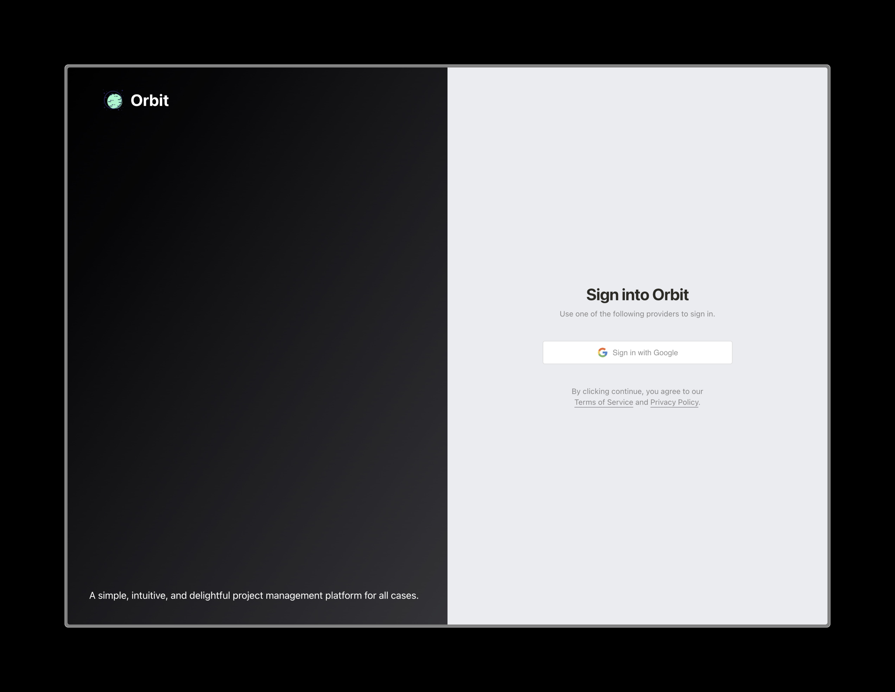
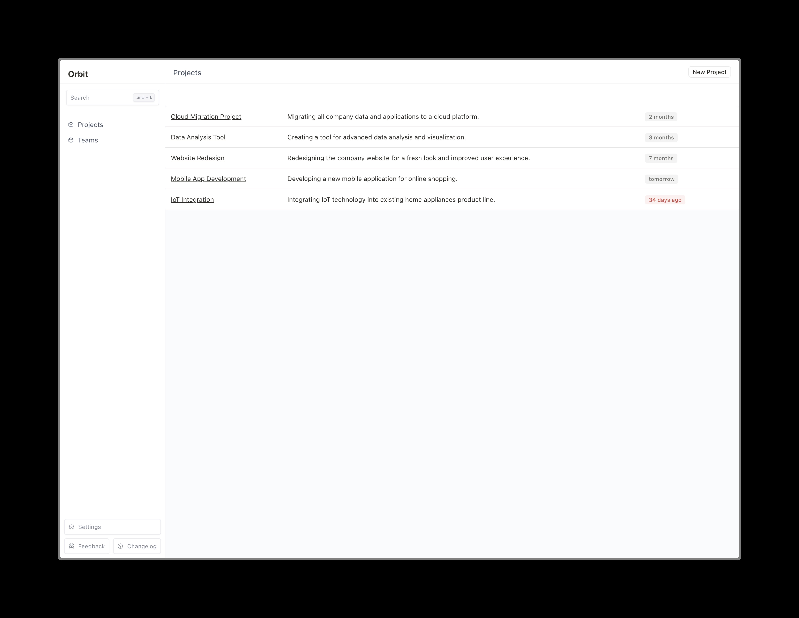
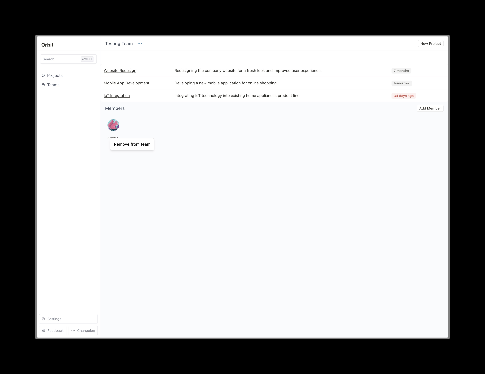

# Orbit

A simple, intuitive, and beautiful way to manage your projects.

## Features

- TODO

## Roadmap

Check the [CHANGELOG.md](CHANGELOG.md) file for the latest changes.

- TODO

## Getting Started

This is a [Next.js](https://nextjs.org/) project bootstrapped with [`create-next-app`](https://github.com/vercel/next.js/tree/canary/packages/create-next-app).

### Prerequisites

- Have [Node.js](https://nodejs.org/en/) installed.
- Have [npm](https://www.npmjs.com/) installed.
- Have [Git](https://git-scm.com/) installed.
- Setup a [Supabase](https://supabase.com/) project or use an existing one.
  - For Google authentication, follow the instructions [here](https://supabase.io/docs/guides/auth#sign-in-with-google) to setup Google authentication for your Supabase project.

### Installation

Clone the repository:

```bash
git clone https://github.com/armintalaie/Orbit.git
```

Install the dependencies:

```bash
npm install
```

Create a `.env.local` file in the root directory of the project and add the following environment variables:

```text
NEXT_PUBLIC_SUPABASE_URL=<supabase_url>
NEXT_PUBLIC_SUPABASE_ANON_KEY=<supabase_anon_key>
GOOGE_CLIENT_ID=<google_client_id>
GOOGLE_CLIENT_SECRET=<google_client_secret>
```

Run the development server:

```bash
npm run dev
```

Open [http://localhost:3000](http://localhost:3000) with your browser to see the result.

## Learn More

To learn more about the technologies used in this project, take a look at the following resources:

- [Next.js Documentation](https://nextjs.org/docs) - learn about Next.js features and API.
- [Learn Next.js](https://nextjs.org/learn) - an interactive Next.js tutorial.
- [Tailwind CSS Documentation](https://tailwindcss.com/docs) - learn about Tailwind CSS features and API.
- [Shadcn](https://ui.shadcn.com/) - Re-usable components built using Radix UI and Tailwind CSS.
- [Radix UI](https://www.radix-ui.com/) - A collection of open source UI components for building high-quality, accessible design systems and web apps.
- [Supabase](https://supabase.com) - The open source Firebase alternative. Instant APIs, authentication, and realtime subscriptions.

## Deployment

For production, run the following command to ensure everything works as expected:

```bash
npm run build
```

The repository is configured to be deployed to [Railway](https://railway.app/). The main branch is automatically deployed to Railway. If additional environments are needed, they can be created in Railway and the corresponding environment variables can be added to the [Railway dashboard](https://railway.app/).

You can always create your own deployment platfomr on Railway or other platforms. The following are some of the options:

- [Vercel](https://vercel.com/)
- [Netlify](https://www.netlify.com/)
- [Heroku](https://www.heroku.com/)

This command builds the application for production usage and optimizes the build for the best performance.

- TODO

## Contributing

_Under construction_

Contributions are always welcome!

To contribute to Orbit, clone this repo locally and follow the [Getting Started](#getting-started) instructions. Check the currently open issues in the [Issues](https://github.com/armintalaie/Orbit/issues) tab for ideas on how to contribute.

When you are ready to start working on an issue, create a new branch with a descriptive name, for example:

```bash
git checkout -b fix-404-page
```

After you have made the necessary changes, commit your changes and push your branch to GitHub:

```bash
git add .
git commit -m "Fix 404 page"
git push -u origin fix-404-page
```

Finally, open a pull request on GitHub and describe the changes you have made and mention the issue you have fixed.

To submit new issues, use the [Issues](https://github.com/armintalaie/Orbit/issues) tab and follow the provided template.

## Screenshots








